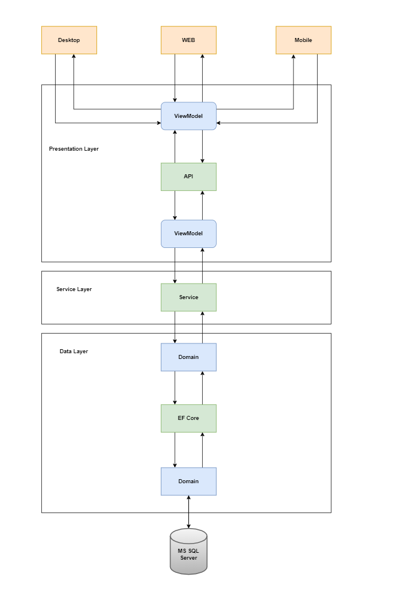
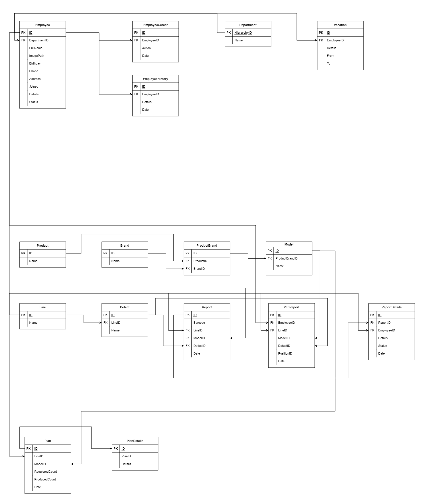

# API for Mancufacturing company's production control & management

### Project is developing with `N-Layer` architecture, and under proccess

* Access - DataBase Layer
* API - WebApi `ASP.NET Core`
* Common - Common classes, methods, exceptions
* Domain - Pure `POCO` classes
* Service - Application business logics

## Database design

